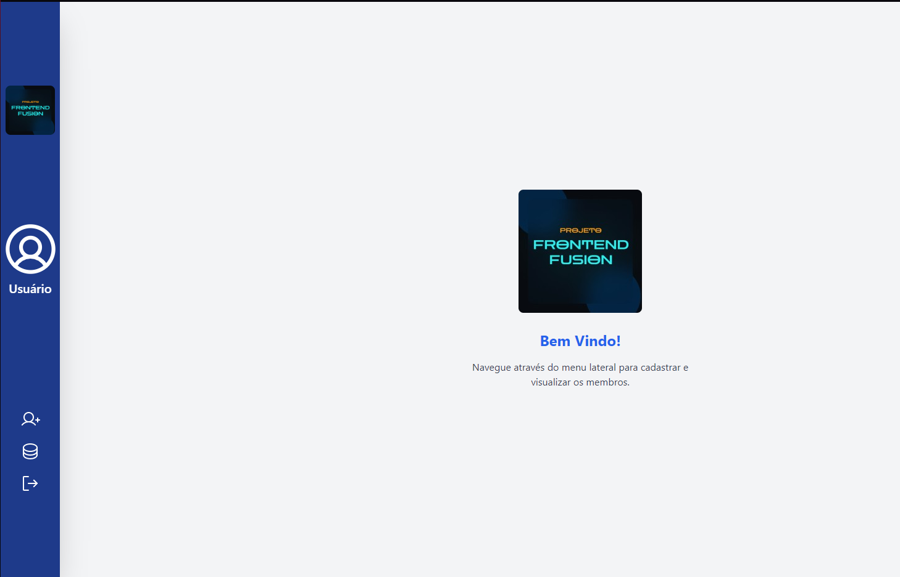

# Projeto: Formulário de Cadastro de Membros

O Formulário de Cadastro de Membros é um dos projetos feito para concorrer a uma vaga de dev frontend na comunidade Frontend Fusion.
O objetivo foi Desenvolver um formulário de cadastro de membros utilizando React, validação de dados com Yup ou Zod, e salvando os dados localmente.





## Tecnologias Utilizadas

- Vite: Ferramenta de build para um ambiente de desenvolvimento rápido e eficiente.
- React: Biblioteca JavaScript para criação da interface do usuário.
- Tailwind: Framework CSS para estilização da página.
- Phosphor icons: Ícones utilizados na página.
- Local Storage: Armazenamento de dados do formulário.
- React-hook-form: Gerenciamento do formulário.
- React-router: Gerenciamento de rotas. 
- Zod: Validação do formulário.


## Estrutura da Página

- Cadastro: Exibe o formulário de cadastro.
- Membros: Exibe os membros cadastrados.
- Sair : Exime mensagem de saindo.
 

## Como Executar o Projeto
1. Clone o repositório:

   ```bash
   git clone https://github.com/DevTec2020/GaleriaDev.git
   ```

3. Instale as dependências::

   ```bash
   npm install
   ```
  
4. Inicie o servidor de desenvolvimento:

   ```bash
   npm run dev
   ```